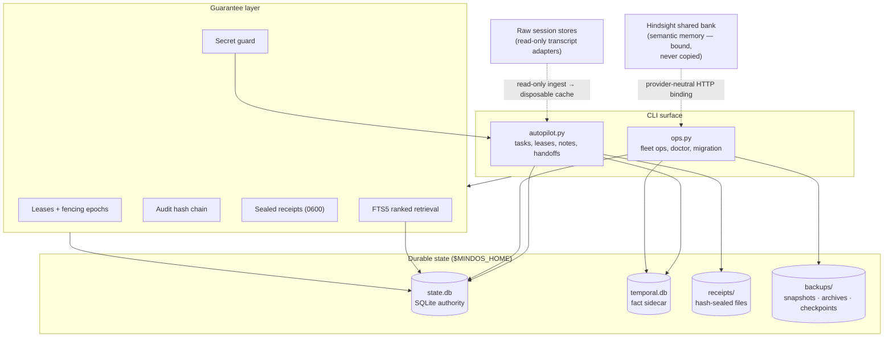
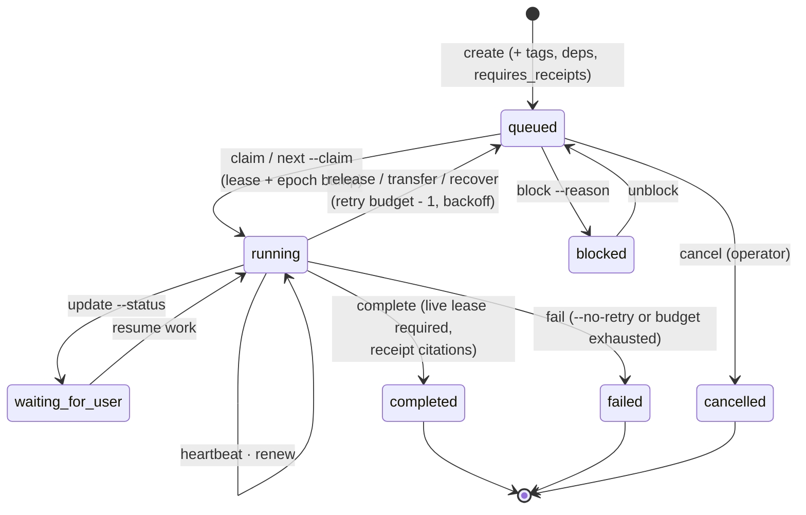
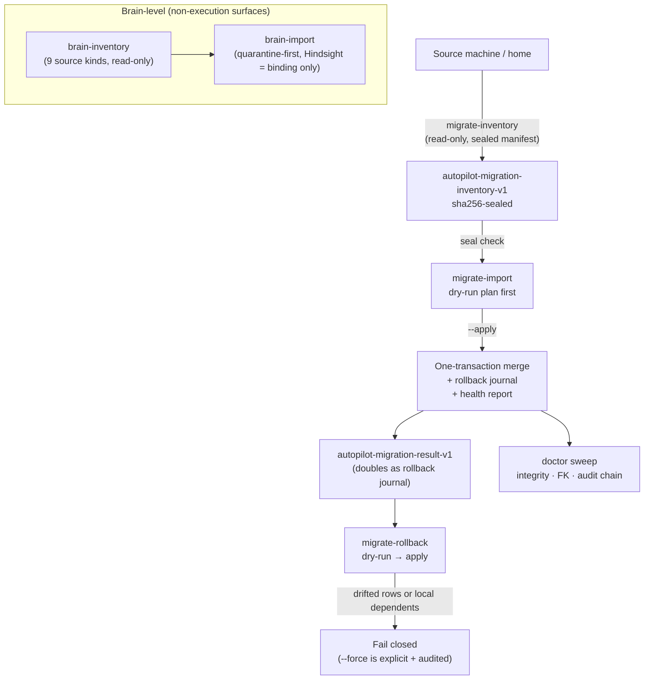
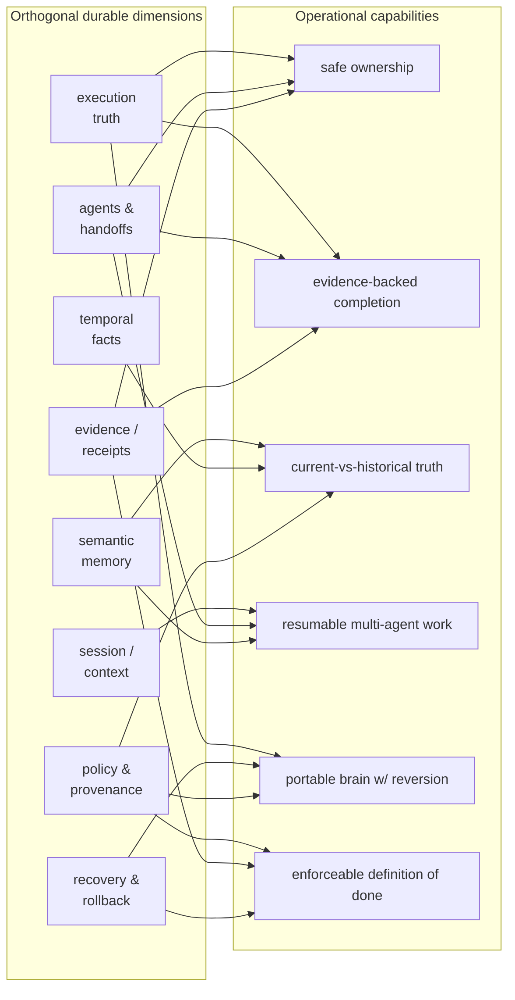

# Architecture Overview

MindOS is a durable local coordination plane ("control tower") for autonomous
agent fleets. It answers one question continuously: *what is true right now,
and what evidence proves it?*

This document explains MindOS — Autopilot v2 — before implementation details.
It is grounded in this repository's source and tests: every architectural
claim in the [fact table](#fact-table) maps to a real source file, command,
test suite, or verified artifact. Nothing here is aspirational.

## The canonical model

MindOS is not a list of features; it is the composition of orthogonal durable
dimensions:

```text
execution truth
× semantic memory
× temporal facts
× session/context history
× agents and handoffs
× evidence/receipts
× recovery and rollback
× policy and provenance
```

Each dimension exists on its own (Git + Markdown can already store much of
this data). What MindOS adds is making their *combinations* operational:
concurrency control, atomic transitions, ranked retrieval, policy gates,
sealed evidence, temporal validity windows, and reversible migration become
queryable primitives instead of conventions agents are asked to follow.

The clearest examples of the combinatorial model — `agent + task + lease =
safe ownership`, `policy + receipt + audit chain = enforceable definition of
done`, and more — live in [docs/COMBINATORIAL-ARCHITECTURE.md](docs/COMBINATORIAL-ARCHITECTURE.md).

## Diagrams

All diagrams render natively on GitHub.

1. [System layers and data flow](#1-system-layers-and-data-flow)
2. [Agent / task / lease / receipt lifecycle](#2-agent-task-lease-receipt-lifecycle)
3. [Memory and context retrieval path](#3-memory-and-context-retrieval-path)
4. [Migration and rollback path](#4-migration-and-rollback-path)
5. [Combinatorial capability matrix](#5-combinatorial-capability-matrix)

### 1. System layers and data flow



Data flows one way into SQLite as execution truth. Hindsight stays an external
shared bank accessed by GET-only probes; raw transcripts index into a
rebuildable cache that is never treated as truth.

### 2. Agent / task / lease / receipt lifecycle



Every transition writes a hash-chained audit event (`claimed`,
`lease_renewed`, `completed`, `task_failed_terminal`, …). Stale leases are
swept by `ops.py recover`; fencing epochs reject stale holders even when the
owner name still matches.

### 3. Memory and context retrieval path

```mermaid
flowchart LR
    T["Task text"] --> Q["FTS5 OR-combined query"]
    subgraph Candidates
        N["Own notes<br/>(pinned first)"]
        RN["Related notes<br/>(cross-task RAG)"]
        RH["Related handoffs<br/>(neighbor resume points)"]
        DC["Dep context<br/>(completed prerequisites)"]
        RS["Related sessions<br/>(redacted cache)"]
        FA["Related facts<br/>(currently-valid triples)"]
    end
    Q --> Candidates
    Candidates --> RR{"--rerank?"}
    RR -->|yes| HY["Hybrid score:<br/>BM25 × recency decay + pin boost"]
    RR -->|no| PK
    HY --> PK["Budget packer<br/>header → deps → handoff → notes → related"]
    PK --> DG["Sealed SHA-256 digest<br/>(deterministic)"]
    DG --> AU["Audited context_recalled event<br/>(digest + bundle params)"]
    DG --> V["recall-verify / recall-diff<br/>freshness proof"]
```



`context`, `recall`, `resume`, and `next --claim --recall` all share this one
pack path. Every recall seals a deterministic digest and records its bundle
parameters in the audit ledger, so cited digests can be recomputed exactly
later (`ops.py recall-stale`) — provenance for context, not vibes.

### 4. Migration and rollback path



Sources are never mutated (proved by full-fixture hash comparisons in
`verify.py`). Orphan receipts are quarantined, leases sanitize to `queued`,
audit chains refuse foreign merges without explicit `--relink-audit`, and
every applied import is precisely undoable via its journal.

### 5. Combinatorial capability matrix



Each capability is a combination, not a module. The full derivation table is
in [docs/COMBINATORIAL-ARCHITECTURE.md](docs/COMBINATORIAL-ARCHITECTURE.md).

## Layers

```
┌──────────────────────────────────────────────────────────┐
│ CLI surface: autopilot.py (tasks) · ops.py (fleet ops)   │
├──────────────────────────────────────────────────────────┤
│ Guarantees: leases w/ fencing epochs · audit hash chain  │
│ receipt sealing · secret guard · FTS search              │
├──────────────────────────────────────────────────────────┤
│ SQLite home ($MINDOS_HOME): state.db + optional          │
│ temporal.db fact-graph sidecar                           │
├──────────────────────────────────────────────────────────┤
│ Migration/inventory layer: dry-run-first manifests,      │
│ rollback journal, orphan quarantine                      │
└──────────────────────────────────────────────────────────┘
```

### autopilot.py — execution truth

Tasks, claims, live leases with monotonic fencing epochs, heartbeats,
retry budgets/backoff, receipts (hash-sealed 0600 evidence files), notes with
supersession, a provenance-linked fact graph (temporal triples with validity
windows), handoffs between agents with recall digests, dependency edges,
impact analysis, dispatch planning, metrics, and a tamper-evident global audit
stream (`verify-chain` recomputes the hash chain).

### ops.py — fleet operations

Recovery of stale leases (guarded so mid-sweep claim losses are skipped and
reported), escalation, doctor health checks (including FTS5 inverted-index
drift detection via fts5vocab), project policies under `policies/`,
migration inventory/import/rollback, brain inventory across nine source kinds
(Autopilot, Hindsight binding, temporal sidecar, Claude memory sync, memory
archives, sessions, profiles/skills, cron definitions).

### verify.py — end-to-end verification

Self-contained suite that builds disposable fixture homes and exercises every
command, including failure injection, race injection, interrupted re-runs,
rollback to zero, source immutability, secret-guard refusal/redaction, FTS
drift, Hindsight-unavailable degradation, and cross-agent probes. This suite
is the primary evidence base for the fact table below.

## Core invariants

1. **Single authority** — SQLite is the execution authority; Hindsight remains
   a shared semantic bank and is never copied into SQLite as a second one.
2. **Fail closed** — ambiguity/corruption refuses with exact blockers; absent
   optional sources are recorded honestly without blocking.
3. **Evidence over claims** — completions require sealed receipts; audit
   events are digest-only where values could be sensitive.
4. **Dry-run first** — destructive operations plan first, apply only on an
   explicit flag, journal for rollback, and re-run idempotently.
5. **Source immutability** — migration reads never mutate their sources;
   full-fixture hash comparisons prove it.

## Fact table

Every architectural claim above maps to its implementing source and its
verification. "Verified by" names either the end-to-end suite (`python3
verify.py`, which builds disposable fixture homes and exercises the real CLI)
or the named command itself.

| Claim | Source of truth | Verified by |
| --- | --- | --- |
| Tasks, deps, dispatch, notes, handoffs, facts, audit live in one SQLite home | `autopilot.py` (schema init, `state.db`) | `verify.py` full suite |
| Leases carry monotonic `lease_epoch` fencing; stale holders rejected | `autopilot.py` (`lease_epoch` column + guarded mutations) | fenced complete/release tests in `verify.py` |
| Claim-before-complete; only live-lease holder completes | `autopilot.py` `complete` guard | lifecycle guardrail tests in `verify.py` |
| First-class failure with shared retry budget + exponential backoff | `autopilot.py` `fail`; `ops.py recover` | failure/backoff injection tests in `verify.py` |
| Audit events form a SHA-256 hash chain, recomputed by `verify-chain` | `autopilot.py` (`events`, `verify-chain`) | chain/tamper checks in `verify.py`; `metrics` command |
| Checkpoints detect tail truncation, not just modification | `ops.py checkpoint` / `checkpoint-check`; `doctor` validates pins | checkpoint tests in `verify.py` |
| Receipts are hash-sealed 0600 files; doctor re-verifies file hashes | `autopilot.py receipt`; `ops.py doctor` | `receipt_file_hash_mismatch` tests in `verify.py` |
| Completions cite same-task receipts; missing kinds block completion | `autopilot.py complete --receipt/--requires-receipt` | `completion_blocked_evidence` tests in `verify.py` |
| Secret guard refuses/redacts credential-shaped content, kind-only reporting | `autopilot.py note/handoff` scanners; `ops.py secret-scan` | refusal/redaction/override tests in `verify.py`; CI secret scan |
| Notes supersede, expire (TTL), pin, dedupe, near-dup-flag | `autopilot.py note/supersede-note/context` | note lifecycle tests in `verify.py`; `ops.py consolidate` |
| BM25-ranked retrieval over external-content FTS5 with drift detection | `autopilot.py search/search-notes/search-handoffs/search-facts/search-sessions` | fts5vocab drift tests in `ops.py doctor`, covered in `verify.py` |
| Hybrid rerank (BM25 × recency decay + pin boost) keeps digests stable | `autopilot.py --rerank` flags | rerank/determinism tests in `verify.py` |
| Recall packs seal deterministic digests; freshness recomputable | `autopilot.py recall/recall-verify/recall-diff` | digest stability + drift tests in `verify.py` |
| Handoff protocol: addressed, acked, linted, inboxed across agents | `autopilot.py handoff/ack/handoff-inbox`; `ops.py handoff-check` | cross-agent probe (`onboard --probe`) + lint tests in `verify.py` |
| Temporal facts carry validity windows + soft task provenance | `autopilot.py fact-assert/facts/search-facts`; `temporal.db` | fact graph tests in `verify.py` |
| Project policies gate readiness and dispatch (tags, WIP caps) | `policies/*.yaml`; `autopilot.py next/claim`; `ops.py policy` | `claim_refused_policy` / approval-gate tests in `verify.py` |
| Snapshots/archives are self-hash-sealed, restorable, chain-preserving | `ops.py snapshot/archive/snapshot-restore/archive-restore` | restore-to-zero + tamper tests in `verify.py` |
| Work orders export/import full task state, tamper-evident, lease-sanitized | `ops.py export-task/import-task` | work-order round-trip tests in `verify.py` |
| Migration inventory is read-only, sealed, fail-closed, bounded | `ops.py migrate-inventory/migrate-inventory-check` | full-fixture hash-comparison immutability tests in `verify.py` |
| Import merges idempotently, quarantines orphan receipts, relinks audit safely | `ops.py migrate-import --apply` | interrupted re-run + quarantine tests in `verify.py` |
| Rollback removes exactly what an apply inserted; fails closed on drift | `ops.py migrate-rollback` | rollback-to-zero + drifted-row tests in `verify.py` |
| Brain inventory reads nine source kinds without mutating anything | `ops.py brain-inventory/brain-inventory-check` | nine-source role assertions + no-mutation hashes in `verify.py` |
| Hindsight is bound, never copied into SQLite | `ops.py brain-import` (`bindings/hindsight-shared-bank.json`) | degraded/unavailable-bank tests in `verify.py` |
| Session ingestion is a redacted, rebuildable cache — never truth | `autopilot.py session-scan/session-ingest/sessions-prune` | cache/rebuild/prune tests in `verify.py` |
| One-command onboarding runs staged, dry-run-first, doctor-gated | `ops.py onboard` | stage-failure stop tests in `verify.py` |

No benchmark numbers or production claims are made anywhere in these docs;
everything above is reproducible from this repository alone.

See `README.md` for command-level detail and `STABILITY.md` for the audited
risk ledger.
